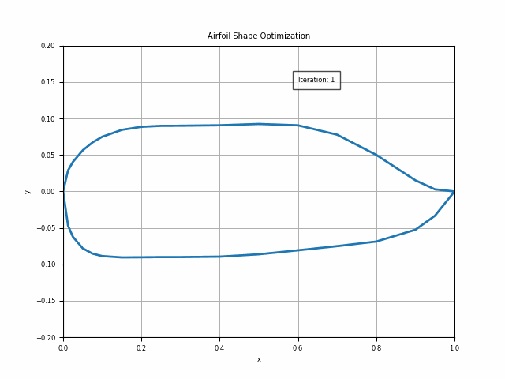

# Airfoil-Optimization-Using-Gradient-Descent

This project explores airfoil optimization using gradient descent. It has not achieved its desired results yet
and is currently a work in progress and serves as a foundation for testing this optimization algorithm.

## Features
- Uses **PARSEC parameterization**, coupled with **XFOIL** through the `pyxfoil` library.
- Shape updates are made for optimization (requires `pip install pyxfoil`).

## Feedback
Any suggestions or corrections to the code are welcome.  
Contact: [priperfect2207@gmail.com](mailto:priperfect2207@gmail.com).
